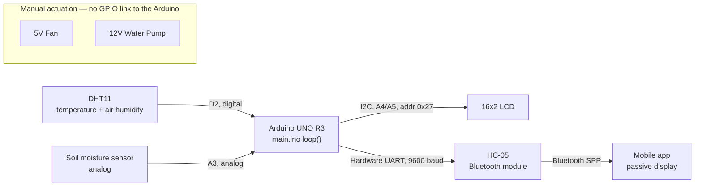

<h1 align="center">
  
  Automated Greenhouse Prototype
</h1>

<p align="center">
  <a href="https://www.arduino.cc/"></a>
  <a href="https://www.arduino.cc/reference/en/"></a>
  <a href="#"></a>
  <a href="./LICENSE"></a>
</p>

<p align="center">
  Embedded environmental-monitoring prototype built on an Arduino UNO R3. The system samples ambient temperature, air humidity, and soil moisture, shows the readings on a local LCD, and streams them over Bluetooth to a paired mobile device.
</p>

<p align="center">
  Developed by the AMIP group as an academic project applying embedded systems and automation concepts to greenhouse management on Cutijuba Island. Automation covers <strong>sensing and reporting only</strong> — irrigation and ventilation stay on manual switches, not closed-loop control.
</p>

---

<p align="center">
  
</p>

---

## System Architecture



Fan and water pump are wired to their own 5V/12V rails via manual slide switches — there is no signal path from the Arduino to either.

---

## Hardware

| Component | Role | Arduino Connection |
|---|---|---|
| Arduino UNO R3 | Controller | — |
| DHT11 | Temperature and air-humidity sensor | Digital, pin D2 |
| Resistive soil-moisture sensor | Soil hydration reading | Analog, pin A3 |
| 16x2 LCD + I2C backpack | Local display | I2C (A4/SDA, A5/SCL), address `0x27` |
| HC-05 | Bluetooth-to-serial module | Hardware UART (D0/D1, shared with USB), 9600 baud |
| 5V fan | Ventilation | Own 5V rail, manual slide switch — **not** GPIO-driven |
| 12V DC30A-1230 water pump | Irrigation | Own 12V rail, manual slide switch — **not** GPIO-driven |
| 5V / 12V power supplies | Separate rails for logic and pump | Isolates motor electrical noise from the sensing circuit |

> The HC-05 shares the Arduino's UART with USB programming. Disconnect it (or hold its enable line low) before uploading new firmware, or the upload will fail/corrupt.

---

## Firmware

`main.ino` runs a blocking `loop()`: each cycle reads temperature, air humidity, and soil moisture, displays them in turn on the LCD, then transmits all three over `Serial` to the HC-05.

**Dependencies** (install via Arduino Library Manager):

- [`LiquidCrystal_I2C`](https://www.arduinolibraries.info/libraries/liquid-crystal-i2c) — drives the LCD over I2C
- [`DFRobot_DHT11`](https://github.com/DFRobot/DFRobot_DHT11) — reads the DHT11

**Cycle timing.** Each `loop()` iteration is dominated by four sequential `delay()` calls (two 3000 ms LCD holds inside `temperatura()`/`display()`, one 3000 ms hold inside the second `display()` call, and a 2000 ms pause in `bluetoohMensagem()`), so a full read-display-transmit cycle takes roughly 11 seconds. Nothing else — including listening for incoming Bluetooth data — can happen while a `delay()` is in progress.

**Bluetooth output.** Once per cycle, a single line is transmitted:

```
[ Umid do Ar: <humidity>% ]   [ Temp: <temperature>°C ]   [ Umid da Terra: <soil>% ]
```

This is a human-readable line intended for a Bluetooth serial-terminal app, not a structured/parseable format (no CSV, JSON, or delimiter contract).

### Build and Upload

1. Open `main.ino` in the Arduino IDE.
2. Install the two dependencies above.
3. Select **Board: Arduino UNO** and the correct **Port**.
4. Disconnect the HC-05, then upload the sketch.
5. Reconnect the HC-05, pair it with a phone (default pairing code `1234` or `0000`), and open a Bluetooth serial-terminal app to view telemetry.

---

## Known Issues

`main.ino`'s `display()` function contains `lcd.print(mensag / em1);` — `mensag` and `em1` are undeclared, so this line reads as a corrupted reference to `mensagem1` and won't compile as written. The loop is also fully `delay()`-based (~11 s/cycle), so nothing else can run while a display hold or transmit pause is in progress.

---

## Mobile Client

The phone side is a passive viewer: it connects to the HC-05 over Bluetooth SPP (Serial Port Profile) and displays incoming readings, with no commands sent back to the Arduino. Any app capable of showing incoming Bluetooth serial text works.

The app used during development showed air temperature, air humidity, and soil moisture over a plant-themed background, as in the screenshot below. That specific app is no longer available; this image is the only remaining record of it.


---

## Project Video


<details>
  <summary>YouTube</summary>
  <p><strong>Portuguese:</strong> <a href="https://youtu.be/CeOX5DaF4m8">Watch on YouTube</a></p>
  <p><strong>English:</strong> <a href="https://youtu.be/XomKhprOvek">Watch on YouTube</a></p>
</details>

---

## License

Distributed under the MIT License. See [LICENSE](./LICENSE) for the full text.

---

## Team

| Name | Email |
|------|-------|
| Liane Ferreira Heidemann | liane22070222@aluno.cesupa.br |
| Luis Imhotep | luis22070056@aluno.cesupa.br |
| Fabio Gabriel Areas | fabio21070209@aluno.cesupa.br |
| Fellipe Santos | fellipe20070001@aluno.cesupa.br |
| Luan Augusto | luan22070212@aluno.cesupa.br |

---
