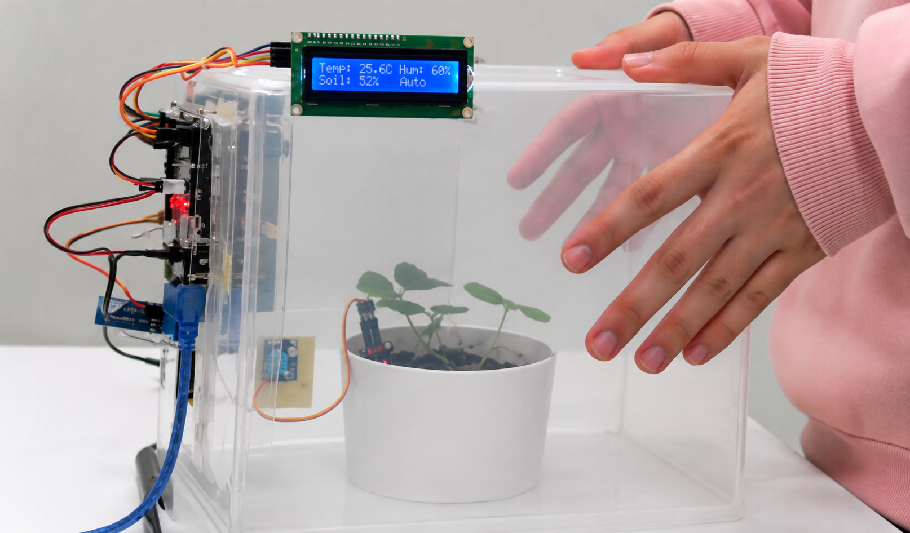
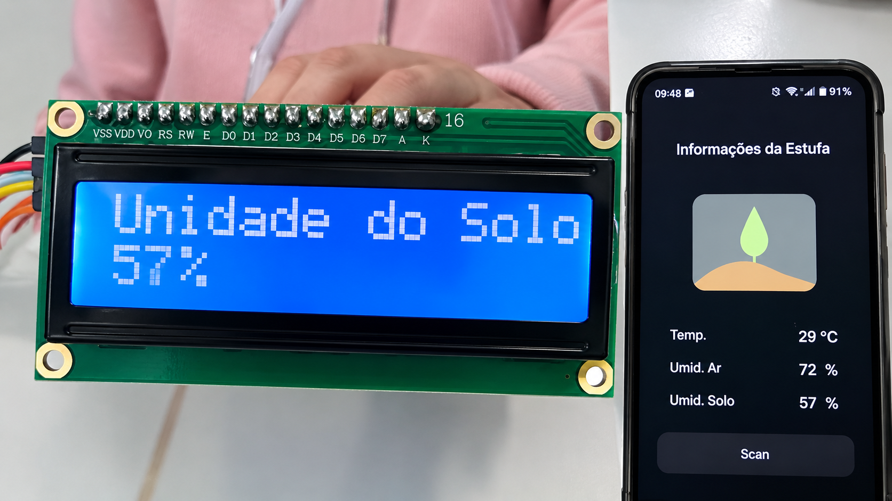

<h1 align="center">
  
  Automated Greenhouse Prototype
</h1>

<p align="center">
  <a href="https://www.arduino.cc/"></a>
  <a href="https://www.arduino.cc/reference/en/"></a>
  <a href="./LICENSE"></a>
</p>

<p align="center">
  Firmware and hardware design for an embedded environmental-monitoring prototype built on an Arduino UNO R3. The system reads ambient temperature, air humidity, and soil moisture, displays the readings on an LCD, and transmits them over Bluetooth to a mobile device.
</p>

<p align="center">
  Developed by the AMIP group as an academic project applying embedded systems and automation to agricultural greenhouse management on Cutijuba Island.
</p>

---

<p align="center">
  
</p>

---

## Hardware

| Component | Role |
|---|---|
| Arduino UNO R3 | Controller |
| DHT11 | Temperature and air-humidity sensor (digital, pin D2) |
| Resistive soil-moisture sensor | Soil hydration reading (analog, pin A3) |
| 16x2 LCD + I2C backpack | Local display (I2C address `0x27`) |
| HC-05 | Bluetooth-to-serial module (shares the Arduino's hardware UART, 9600 baud) |
| 5V fan | Ventilation |
| 12V DC30A-1230 water pump | Irrigation |
| On/off slide switches | Manual control of fan and pump |
| 5V / 12V power supplies | Separate rails for logic and pump, to isolate motor noise |

> Because the HC-05 shares the Arduino's UART with USB programming, disconnect it (or hold its enable line low) before uploading new firmware.

---

## Firmware

`main.ino` runs a simple blocking loop: each cycle reads temperature, air humidity, and soil moisture, shows them in turn on the LCD, then sends all three over `Serial` to the HC-05.

Dependencies (install via Arduino Library Manager):

- [`LiquidCrystal_I2C`](https://www.arduinolibraries.info/libraries/liquid-crystal-i2c) — drives the LCD over I2C
- [`DFRobot_DHT11`](https://github.com/DFRobot/DFRobot_DHT11) — reads the DHT11

Each cycle, one line is transmitted over Bluetooth:

```
[ Umid do Ar: <humidity>% ]   [ Temp: <temperature>°C ]   [ Umid da Terra: <soil>% ]
```

It's a plain, human-readable line meant for display in a Bluetooth serial-terminal app, not a structured/parseable format.

### Build and Upload

1. Open `main.ino` in the Arduino IDE.
2. Install the two dependencies above.
3. Select **Board: Arduino UNO** and the correct **Port**.
4. Disconnect the HC-05, then upload the sketch.
5. Reconnect the HC-05, pair it with a phone (default code `1234` or `0000`), and open a Bluetooth serial-terminal app to view telemetry.

---

## Mobile Client

The phone side is a passive viewer: it connects to the HC-05 over Bluetooth SPP and displays the incoming readings, with no commands sent back to the Arduino. Any app that can show incoming Bluetooth serial text works.

The app used during development showed air temperature, air humidity, and soil moisture over a plant-themed background, as in the screenshot below. That specific app is no longer available; this image is the only remaining record of it.



---

## Project Video

https://github.com/lianeheidemann/ProjetoDeIrrigacaoMonitoramentoAutomatico_AMIP/assets/54177181/5dc2416f-5027-4611-a1f7-5dbb007b2bb0

<details>
  <summary>YouTube</summary>

**Portuguese:** [Watch on YouTube](https://youtu.be/CeOX5DaF4m8)
**English:** [Watch on YouTube](https://youtu.be/XomKhprOvek)

</details>

---

## License

Distributed under the MIT License. See [LICENSE](./LICENSE) for the full text.

---

## Team

| Name | Email |
|------|-------|
| Liane Ferreira Heidemann | liane22070222@aluno.cesupa.br |
| Luis Imhotep | luis22070056@aluno.cesupa.br |
| Fabio Gabriel Areas | fabio21070209@aluno.cesupa.br |
| Fellipe Santos | fellipe20070001@aluno.cesupa.br |
| Luan Augusto | luan22070212@aluno.cesupa.br |
