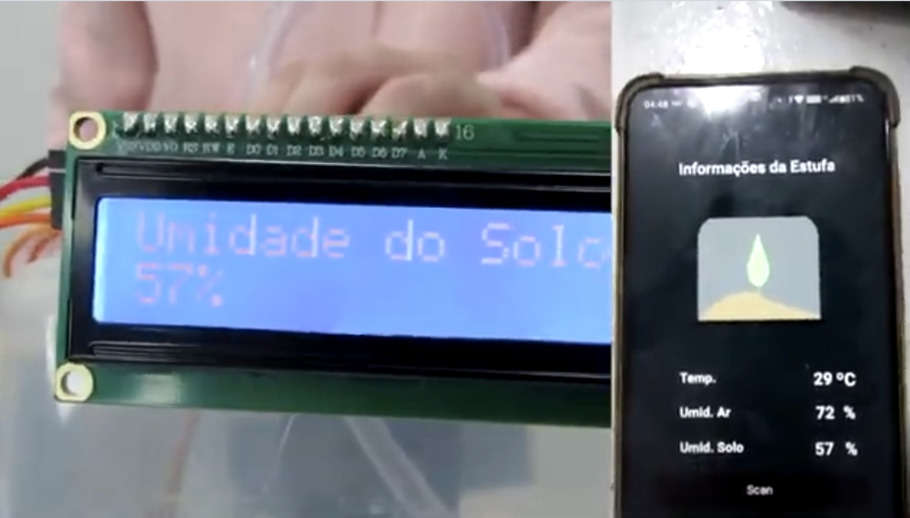

# 🌱 Automated Irrigation and Greenhouse Monitoring

### AMIP Group

An automated irrigation and environmental monitoring prototype for agricultural greenhouses, built with an Arduino UNO. The solution combines temperature, air-humidity, and soil-moisture sensors, collecting real-time data, displaying it on an LCD, and transmitting it to mobile devices over Bluetooth.

---

## Academic Project

Developed to explore automation, embedded systems, and agricultural monitoring with Arduino.

---

## Project Goals

- Introduce technological innovation to Cutijuba Island
- Support agricultural production in the region
- Automate greenhouse irrigation
- Help produce stronger, healthier seedlings
- Enable the cultivation of species that are less resistant to the local climate

---

## Features

- Automated irrigation
- Ambient temperature monitoring
- Air-humidity monitoring
- Soil-moisture monitoring
- Data display on a 16x2 LCD
- Bluetooth data transmission
- Data display on a mobile app over Bluetooth

---

## Mobile Application

Data was also viewed on a phone through a Bluetooth serial-terminal app: a black screen with a plant image in the background, showing the air temperature, air humidity, and soil moisture readings sent by the Arduino. The exact app used has since been lost; the screenshot below is the only remaining record of it.

---

## Components

| Component |
|---|
| Arduino UNO R3 |
| DHT11 temperature and humidity sensor |
| 5V 30x30 mm fan |
| 12V DC30A-1230 water pump |
| Soil-moisture sensor |
| 16x2 LCD |
| I2C serial module for LCD |
| HC-05 Bluetooth module |
| On-off slide switches |
| 0.5 m irrigation hose |
| 5V Arduino power supply |
| 12V water-pump power supply |

---

## How the System Works

The system continuously:

1. Reads the ambient temperature.
2. Reads the air humidity.
3. Reads the soil moisture.
4. Displays the measurements on the LCD.
5. Sends the data to a phone over Bluetooth.

---

## Project Photo

---

## Project Videos

**Portuguese**

> https://github.com/lianeheidemann/ProjetoDeIrrigacaoMonitoramentoAutomatico_AMIP/assets/54177181/27c868d7-40d9-4d39-b8f9-d3db045b137a

  
English

> https://github.com/lianeheidemann/ProjetoDeIrrigacaoMonitoramentoAutomatico_AMIP/assets/54177181/5dc2416f-5027-4611-a1f7-5dbb007b2bb0

  
YouTube links

**Portuguese:** [Watch on YouTube](https://youtu.be/CeOX5DaF4m8)

**English:** [Watch on YouTube](https://youtu.be/XomKhprOvek)

---

## Project Team

| Name | Email |
|------|-------|
| **Liane Ferreira Heidemann** | liane22070222@aluno.cesupa.br |
| **Luis Imhotep** | luis22070056@aluno.cesupa.br |
| **Fabio Gabriel Areas** | fabio21070209@aluno.cesupa.br |
| **Fellipe Santos** | fellipe20070001@aluno.cesupa.br |
| **Luan Augusto** | luan22070212@aluno.cesupa.br |
